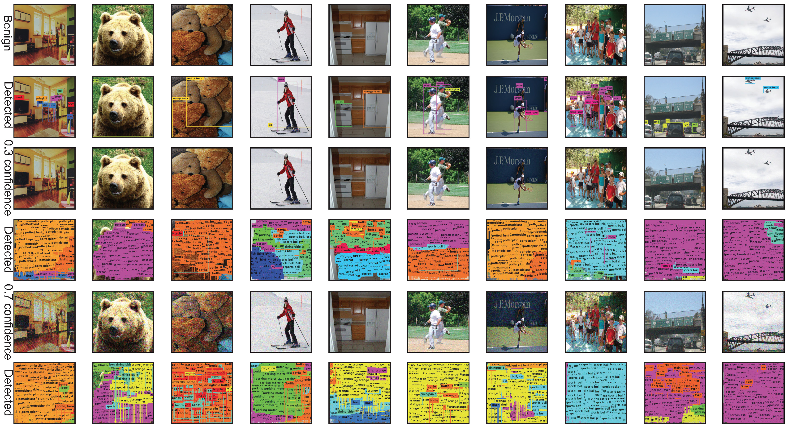

# Daedalus-attack
The code of our paper "Daedalus: Breaking Non-Maximum Suppression in Object Detection via Adversarial Examples".

We propose an attack, in which we can tune the strength of the attack and specify the object category to attack, to break non-maximum suppression (NMS) in object detection. As the consequence, the detection model outputs extremely dense results as redundant detection boxes are not filtered by NMS.

Some results are displayed here:

*Adversarial examples made by our L2 attack. The first row contains original images. The third row contains our low-confidence (0.3) adversarial examples. The fifth row contains our high-confidence (0.7) examples. The detection results from YOLO-v3 are in the rows below them. The confidence controls the density of the redundant detection boxes in the detection results.*

**Launching real-world attacks via a Daedalus poster**

We instantiated the Daedalus perturbation into a physical poster. You can watch the demo of the attack on YouTube:

The code for generating the poster will be released soon.

---

**Running the attack against YOLO-v3:**

1. Download [yolo.h5](https://1drv.ms/u/s!AqftEu9YAdEGidZ7vEm-4v4c2sV-Lw) and put it into '../model';
2. Put original images into '../Datasets/COCO/val2017/';
3. Run l2_yolov3.py.

**Running the attack against RetinaNet:**

1. Install [keras-retinanet](https://github.com/fizyr/keras-retinanet);
2. Download [resnet50_coco_best_v2.1.0.h5](https://drive.google.com/file/d/1N6Xg5SOW8Ic4hpC8PoIRvggcstx0HcXw/view?usp=sharing) and put it into '../model';
3. Put original images into '../Datasets/COCO/val2017/';
4. Run l2_retinanet.py.

**Running ensemble attack to craft robust adversarial examples:**

Run l2_ensemble.py after completing the above setups for YOLO-v3 and RetinaNet attacks.

All attacks can specify object categories to attack. Crafted adversarial examples will be stored as 416X416 sized .png files in '../adv_examples/...'. The examples can be tested on official darknet and retinanet.

**If you find it is useful and use it in your publication. Please kindly cite this work as follows:**

@article{wang2019daedalus,

  title={Daedalus: Breaking Non-Maximum Suppression in Object Detection via Adversarial Examples},
  
  author={Wang, Derui and Li, Chaoran and Wen, Sheng and Nepal, Surya and Xiang, Yang},
  
  journal={arXiv preprint arXiv:1902.02067},
  
  year={2019}
  
}
